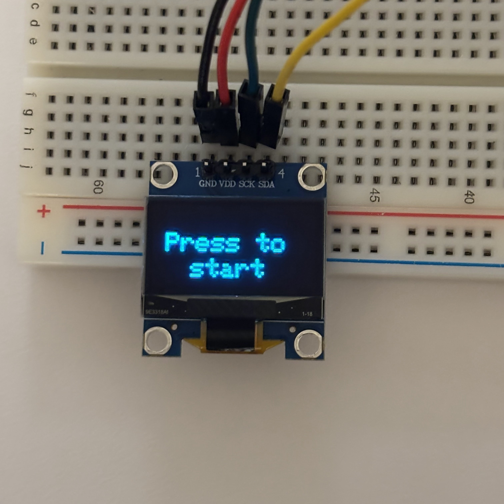

# Sensor-Controlled Flappy Bird with Arduino UNO
## Concept
A motion-controlled Flappy Bird game where the distance of your hand from the ultrasonic distance sensor controls the height of the bird. The game can be started and restarted by pressing the button, and the game ends when the bird hits one of the pipes.

## Circuit Schematic

## Design + Technology
* The ultrasonic sensor measures the distance of an object from the sensor.
* We take the output from the sensor and use it as input to our game.
* We use a moving average calculation to account for outliers in the sensor’s readings
* We randomly generate two pipes at a time to create variety in the obstacles.
* We represent the pipes and the scoring using two different arrays 
* The game ends when the bird touches a pipe

## Gameplay

## Challenges
* Using the button to start gameplay
  * Debouncing
  * Managing game state
* Syncing the timing of the screen refreshing and gathering distance data
  * millis() function + conditionals for each game functionality
* Finding the I2C device address using an I2C scanner

## References
* Handson Technology Ultrasonic Sensor Module User Guide
* Guide for I2C OLED Display with Arduino - Random Nerd Tutorials
* Arduino Playground I2C Scanner
* www.pixilart.com
* javl.github.io/image2cpp/
